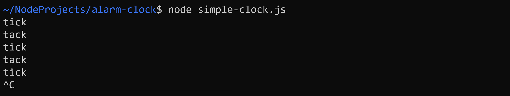
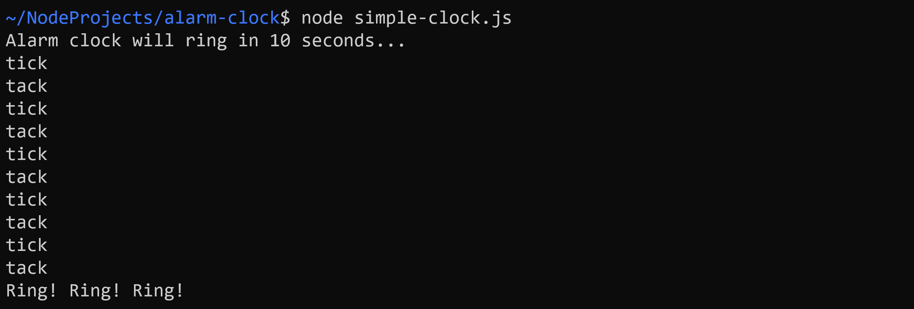
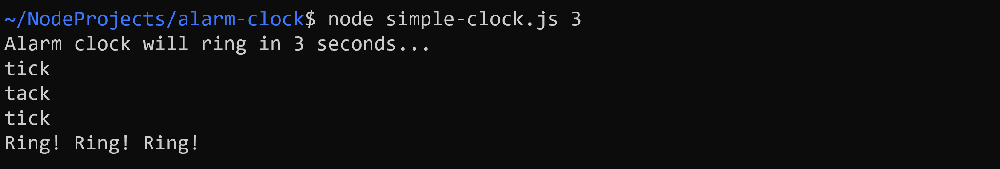
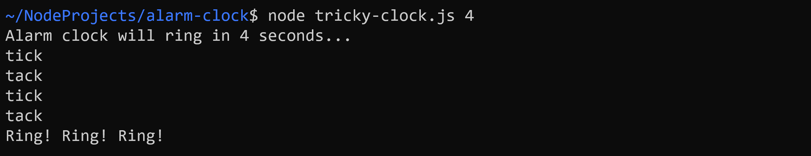

# Alarm Clocks

Ziel dieser Übung ist die Entwicklung von zwei Wecker-Applikationen mithilfe von `setInterval()` und `setTimeout()`.

## Task 1: Simple Clock

Deklarieren Sie in der Datei `simple-clock.ts` folgende Variable:

```javascript
let tick: boolean = true;
```

Implementieren Sie die Funktion `tickTack(tick: boolean): void`. Diese soll bei jedem Aufruf entweder *tick* oder *tack* auf der Konsole ausgeben (abhängig `tick`). Außerdem soll `tick` so verändert werden, dass sich die Ausgabe beim nächsten Aufruf ändert.

Rufen Sie `tickTack()` in einer anonymen Funktion auf, die einmal pro Sekunde ausgeführt wird. Wie im Screenshot ersichtlich, soll abwechselnd *tick* bzw. *tack* ausgeben werden.



**Tipp:** Ihre Applikation würde derzeit endlos weiterlaufen. Mit der Tastenkombination "Ctrl + C" (Windows) bzw. "Command + ." (Mac OS) können Sie ein Node-Programm jedoch jederzeit abbrechen.

## Task 2: Alarm

Erweitern Sie die an `setInterval()` übergebene Funktion, so dass der Wecker nach 10 s läutet und das Programm anschließend beendet wird. Verzichten Sie bis **Task 4** auf die Verwendung von `setTimeout()`!



**Tipp:** Deklarieren Sie unterhalb von `tick` eine Variable `runtime` mit dem Startwert `0`. Verwenden Sie diese neue Variable in der anonymen Funktion, um den Interval-Timer zu löschen.

## Task 3: Adjustable Alarm

Die Anzahl der Sekunden bis zum Läuten des Weckers, soll dem Programm als Parameter übergeben werden können. Falls kein Argument übergeben wird, gilt weiterhin der Defaultwert von 10 s.



## Task 4: Tricky Clock

Entwickeln Sie in der Datei `tricky-clock.ts` eine Wecker-Applikation mit der gleichen Funktionalität wie zuvor. Die neue Anwendung soll jedoch ohne die Funktion `tickTack()`, sowie die "globale" Variablen `tick` und `runtime` auskommen.

Implementieren Sie hierfür die Funktion `tick()`, die einmal *tick* auf der Konsole ausgibt, und analog die Funktion `tack()`.

Verwenden Sie anschließend `setInterval()` und `setTimeout()`, um das gewünschte Verhalten zu erreichen.

